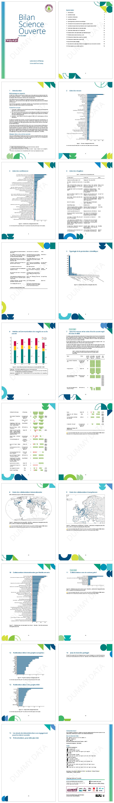

# DiBISO LaTeX templates

LaTeX templates used by the DiBISO at the Université Paris-Saclay to generate reports.

License: LPPL 1.3c or GPL 3.0

## Report types

This repository contains the following templates:

  - `BISO`: Bilan de la Science Ouverte (open-science report)

## Previews

### BiSO

## Authors

This work is dual-licensed under GPL 3.0 (GNU General Public License v3.0 only) or LPPL 1.3c (LaTeX Project Public License v1.3c). You can choose between one of them if you use this work.

Design: Delphine Le Piolet, Laili Rahimie, Romain Thomas

Romain THOMAS 2025  
DiBISO (Direction des Bibliothèques, de l'Information et de la Science Ouverte)  
Université Paris-Saclay
